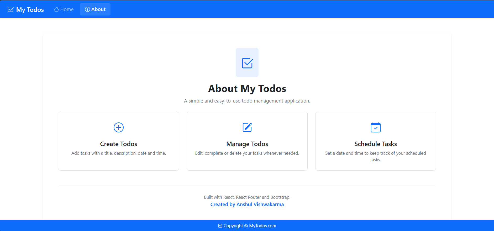
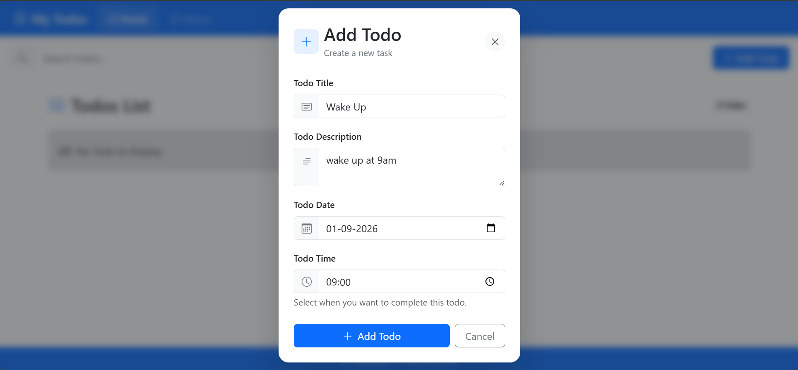
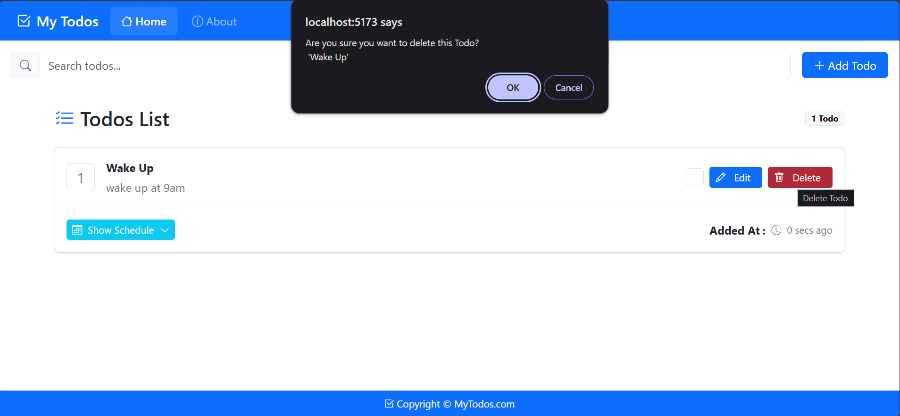
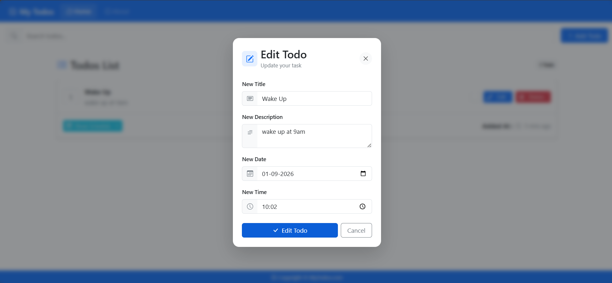
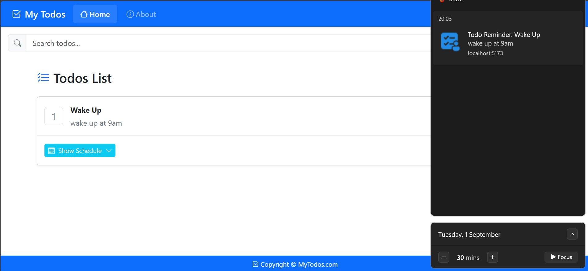
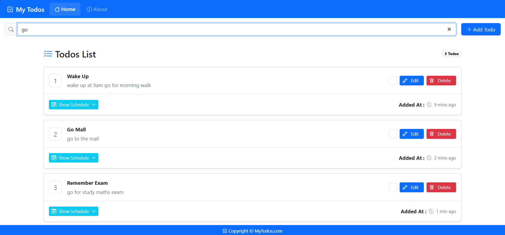

## Introduction

A simple, user-friendly Todo App that supports CRUD (Create, Read, Update, and Delete) operations and stores data in the browser's localStorage. It features a clean and user-friendly UI/UX.

* It does not store any data in the cloud.

* It does not use cookies.

* Simple, reliable, and privacy-focused.

## Pre-Requirements

Node Js

Git (*optional)

GitHub (*optional)

## Setup or Cloning For the repo

>> git clone https://github.com/User_name/repo_name.git

>> npm install

## Extra Intallastions

>> npm install react-router

## Runing & Building

>> npm run dev

>> npm run build  // build

>> npm run preview  // build preview

## Screenshots

### About Todo

### Add Todo

### Delete Todo

### Edit Todo

### Notification Todo

### Search Todo

## Uploading GitHub

// Create a New Repo for this project (*recommended)

>> git init

>> git remote add origin https://github.com/anshulvishwakarma105/MyTodos.git

>> git remote -v

>> git add .

>> git commit -m "Initial Commit"

>> git push -u origin main

>> git status